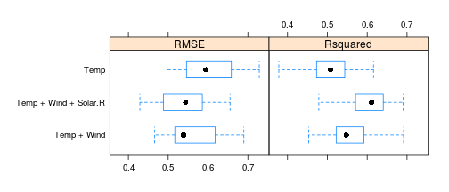

## Intro

* Global warming is a major preoccupation, and recent studies show that temperature raising is
a real concern.
* Ozone pollution is another major concern as our populations became more and more urban, and we can see that Ozone pollution alert are more and more frequent.
* [__OzoneApp__](http://geraudster.shinyapps.io/ozoneApp) aims to analyze the impact of global warming on Ozone pollution and will help predicting Ozone pollution depending on temperature raise.

We use the _airquality_ dataset provided by R, this dataset contains Daily air quality measurements in New York, May to September 1973.

--- .class #id 

## Dataset

The dataset consists of 154 observations on 6 variables:

* `Ozone`: Mean ozone in parts per billion from 1300 to 1500 hours at Roosevelt Island
* `Solar.R`: Solar radiation in Langleys in the frequency band 4000–7700 Angstroms from 0800 to 1200 hours at Central Park
* `Wind`: Average wind speed in miles per hour at 0700 and 1000 hours at LaGuardia Airport
* `Temp`: Maximum daily temperature in degrees Fahrenheit at La Guardia Airport.

Below is a sample code after imputing missing values:

```
##   Ozone Solar.R Wind Temp Month Day
## 1    41     190  7.4   67     5   1
## 2    36     118  8.0   72     5   2
## 3    12     149 12.6   74     5   3
## 4    18     313 11.5   62     5   4
## 5     6     253 14.3   56     5   5
## 6    28     188 14.9   66     5   6
```

--- .class #id 

## Data exploration

* Ozone distribution is left skewed so we will use the log of Ozone to have a normal distribution.

<!--
 
-->

* The following correlation matrix shows that Wind and Temperature have strong correlation with Ozone:

 


--- .class #id 

## The model for prediction

Below we compare different linear regression models:

```r
library(caret)
models <- list(Temp = train(LogOzone ~ Temp, airquality2, method = 'lm'),
               'Temp + Wind' = train(LogOzone ~ Temp + Wind, airquality2, method = 'lm'),
               'Temp + Wind + Solar.R' = train(LogOzone ~ Temp + Wind + Solar.R, airquality2, method = 'lm'))
bwplot(resamples(models))
```

 

We chose the third (`Temp + Wind + Solar.R`), which has lower RMSE and greater R^2.

--- .class #id 

## How to use

Bla bla 

"Ozongassmolekyl" by Ingvald Straume - Own work. Licensed under CC BY-SA 3.0 via Wikimedia Commons - http://commons.wikimedia.org/wiki/File:Ozongassmolekyl.png#mediaviewer/File:Ozongassmolekyl.png
