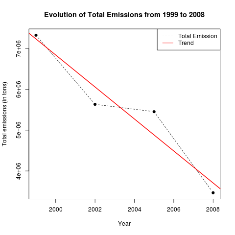
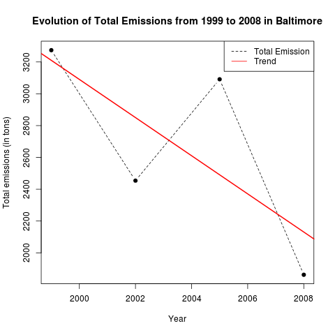
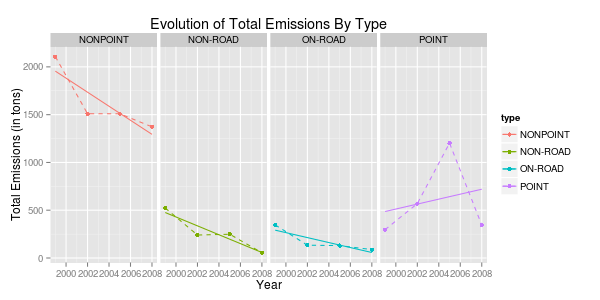
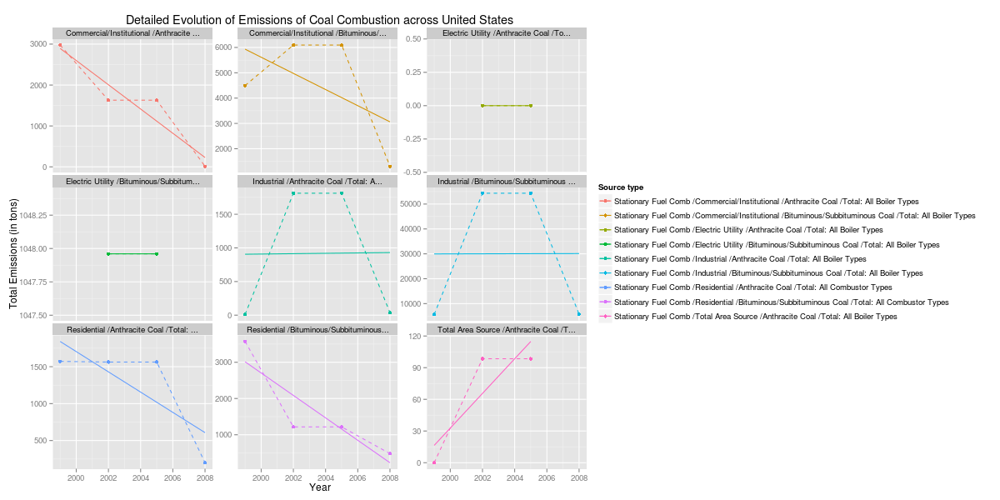

# Course project

 
 
 
 
 
 

# Links

## Samples for ggplot

* http://www.cyclismo.org/tutorial/R/plotting.html
* http://sharpstatistics.co.uk/r/ggplot2-guide/
* GGplot2 doc: http://docs.ggplot2.org/current/
* Legends: http://www.cookbook-r.com/Graphs/Legends_%28ggplot2%29/
* Facets: http://www.cookbook-r.com/Graphs/Facets_%28ggplot2%29/
