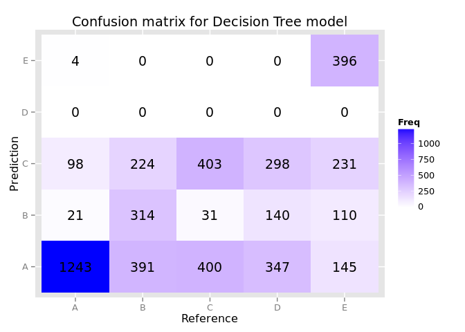
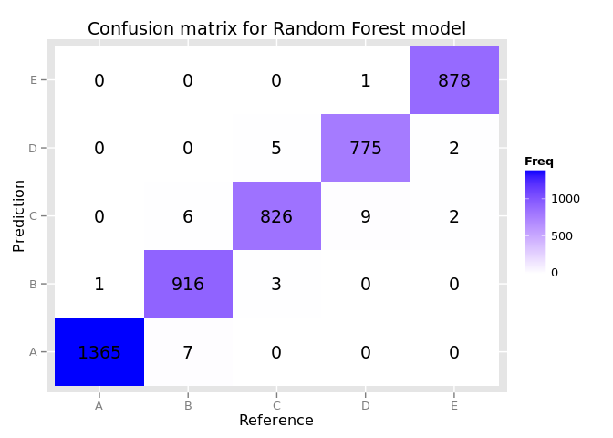

# Prediction Assignment Writeup

## Project Objectives

This project is related to Human Activity Recognition and the goal is 
to analyze data from Weight Lifting Exercises [@velloso2013qualitative].

This data set contains several variables used to measure different characteristics
of a movement : coordinates in space, pitch, roll...

The objectives are:

* train a model on this dataset (in fact we will try 2 models Decision Tree and Random Forest, then choose the best model)
* for each model: validate the model against out of sample data
* submit the best model to 20 test cases provided in the assignement


## Install libraries

First we will need some libraries:

```r
options(repos = c('http://cran.rstudio.com'))
install.packages('caret')
```

```
## 
## The downloaded source packages are in
## 	'/tmp/Rtmp8o9aoV/downloaded_packages'
```

```r
install.packages('e1071')
```

```
## 
## The downloaded source packages are in
## 	'/tmp/Rtmp8o9aoV/downloaded_packages'
```

```r
install.packages('gbm')
```

```
## 
## The downloaded source packages are in
## 	'/tmp/Rtmp8o9aoV/downloaded_packages'
```

```r
install.packages('randomForest')
```

```
## 
## The downloaded source packages are in
## 	'/tmp/Rtmp8o9aoV/downloaded_packages'
```

```r
install.packages('doMC', dependencies = TRUE)
```

```
## 
## The downloaded source packages are in
## 	'/tmp/Rtmp8o9aoV/downloaded_packages'
```

## Data loading

Then we load the data, and create the train set and test set (75% vs. 25%):

```r
source('loadData.R')
trainingUrl <- 'https://d396qusza40orc.cloudfront.net/predmachlearn/pml-training.csv'
testingUrl <- 'https://d396qusza40orc.cloudfront.net/predmachlearn/pml-testing.csv'
  
loadDataFile(trainingUrl, "data/pml-training.csv", unzip=FALSE)
loadDataFile(testingUrl, "data/pml-testing.csv", unzip=FALSE)

data <- read.csv("data/pml-training.csv")
inTrain <- createDataPartition(y=data$classe, p=0.75, list=FALSE)

training <- data[inTrain,]
testing <- data[-inTrain,]

validation <- read.csv("data/pml-testing.csv")
```

The `validation` set will be used to submit test cases to the model.

Several columns contain lots of empty or NAs values:

```r
str(training)
```

```
## 'data.frame':	14718 obs. of  160 variables:
##  $ X                       : int  2 3 5 6 8 9 10 11 12 14 ...
##  $ user_name               : Factor w/ 6 levels "adelmo","carlitos",..: 2 2 2 2 2 2 2 2 2 2 ...
##  $ raw_timestamp_part_1    : int  1323084231 1323084231 1323084232 1323084232 1323084232 1323084232 1323084232 1323084232 1323084232 1323084232 ...
##  $ raw_timestamp_part_2    : int  808298 820366 196328 304277 440390 484323 484434 500302 528316 576390 ...
##  $ cvtd_timestamp          : Factor w/ 20 levels "02/12/2011 13:32",..: 9 9 9 9 9 9 9 9 9 9 ...
##  $ new_window              : Factor w/ 2 levels "no","yes": 1 1 1 1 1 1 1 1 1 1 ...
##  $ num_window              : int  11 11 12 12 12 12 12 12 12 12 ...
##  $ roll_belt               : num  1.41 1.42 1.48 1.45 1.42 1.43 1.45 1.45 1.43 1.42 ...
##  $ pitch_belt              : num  8.07 8.07 8.07 8.06 8.13 8.16 8.17 8.18 8.18 8.21 ...
##  $ yaw_belt                : num  -94.4 -94.4 -94.4 -94.4 -94.4 -94.4 -94.4 -94.4 -94.4 -94.4 ...
##  $ total_accel_belt        : int  3 3 3 3 3 3 3 3 3 3 ...
##  $ kurtosis_roll_belt      : Factor w/ 397 levels "","0.000673",..: 1 1 1 1 1 1 1 1 1 1 ...
##  $ kurtosis_picth_belt     : Factor w/ 317 levels "","0.006078",..: 1 1 1 1 1 1 1 1 1 1 ...
##  $ kurtosis_yaw_belt       : Factor w/ 2 levels "","#DIV/0!": 1 1 1 1 1 1 1 1 1 1 ...
##  $ skewness_roll_belt      : Factor w/ 395 levels "","0.000000",..: 1 1 1 1 1 1 1 1 1 1 ...
##  $ skewness_roll_belt.1    : Factor w/ 338 levels "","0.000000",..: 1 1 1 1 1 1 1 1 1 1 ...
##  $ skewness_yaw_belt       : Factor w/ 2 levels "","#DIV/0!": 1 1 1 1 1 1 1 1 1 1 ...
##  $ max_roll_belt           : num  NA NA NA NA NA NA NA NA NA NA ...
##  $ max_picth_belt          : int  NA NA NA NA NA NA NA NA NA NA ...
##  $ max_yaw_belt            : Factor w/ 68 levels "","0.0","-0.1",..: 1 1 1 1 1 1 1 1 1 1 ...
##  $ min_roll_belt           : num  NA NA NA NA NA NA NA NA NA NA ...
##  $ min_pitch_belt          : int  NA NA NA NA NA NA NA NA NA NA ...
##  $ min_yaw_belt            : Factor w/ 68 levels "","0.0","-0.1",..: 1 1 1 1 1 1 1 1 1 1 ...
##  $ amplitude_roll_belt     : num  NA NA NA NA NA NA NA NA NA NA ...
##  $ amplitude_pitch_belt    : int  NA NA NA NA NA NA NA NA NA NA ...
##  $ amplitude_yaw_belt      : Factor w/ 4 levels "","0.00","0.0000",..: 1 1 1 1 1 1 1 1 1 1 ...
##  $ var_total_accel_belt    : num  NA NA NA NA NA NA NA NA NA NA ...
##  $ avg_roll_belt           : num  NA NA NA NA NA NA NA NA NA NA ...
##  $ stddev_roll_belt        : num  NA NA NA NA NA NA NA NA NA NA ...
##  $ var_roll_belt           : num  NA NA NA NA NA NA NA NA NA NA ...
##  $ avg_pitch_belt          : num  NA NA NA NA NA NA NA NA NA NA ...
##  $ stddev_pitch_belt       : num  NA NA NA NA NA NA NA NA NA NA ...
##  $ var_pitch_belt          : num  NA NA NA NA NA NA NA NA NA NA ...
##  $ avg_yaw_belt            : num  NA NA NA NA NA NA NA NA NA NA ...
##  $ stddev_yaw_belt         : num  NA NA NA NA NA NA NA NA NA NA ...
##  $ var_yaw_belt            : num  NA NA NA NA NA NA NA NA NA NA ...
##  $ gyros_belt_x            : num  0.02 0 0.02 0.02 0.02 0.02 0.03 0.03 0.02 0.02 ...
##  $ gyros_belt_y            : num  0 0 0.02 0 0 0 0 0 0 0 ...
##  $ gyros_belt_z            : num  -0.02 -0.02 -0.02 -0.02 -0.02 -0.02 0 -0.02 -0.02 -0.02 ...
##  $ accel_belt_x            : int  -22 -20 -21 -21 -22 -20 -21 -21 -22 -22 ...
##  $ accel_belt_y            : int  4 5 2 4 4 2 4 2 2 4 ...
##  $ accel_belt_z            : int  22 23 24 21 21 24 22 23 23 21 ...
##  $ magnet_belt_x           : int  -7 -2 -6 0 -2 1 -3 -5 -2 -8 ...
##  $ magnet_belt_y           : int  608 600 600 603 603 602 609 596 602 598 ...
##  $ magnet_belt_z           : int  -311 -305 -302 -312 -313 -312 -308 -317 -319 -310 ...
##  $ roll_arm                : num  -128 -128 -128 -128 -128 -128 -128 -128 -128 -128 ...
##  $ pitch_arm               : num  22.5 22.5 22.1 22 21.8 21.7 21.6 21.5 21.5 21.4 ...
##  $ yaw_arm                 : num  -161 -161 -161 -161 -161 -161 -161 -161 -161 -161 ...
##  $ total_accel_arm         : int  34 34 34 34 34 34 34 34 34 34 ...
##  $ var_accel_arm           : num  NA NA NA NA NA NA NA NA NA NA ...
##  $ avg_roll_arm            : num  NA NA NA NA NA NA NA NA NA NA ...
##  $ stddev_roll_arm         : num  NA NA NA NA NA NA NA NA NA NA ...
##  $ var_roll_arm            : num  NA NA NA NA NA NA NA NA NA NA ...
##  $ avg_pitch_arm           : num  NA NA NA NA NA NA NA NA NA NA ...
##  $ stddev_pitch_arm        : num  NA NA NA NA NA NA NA NA NA NA ...
##  $ var_pitch_arm           : num  NA NA NA NA NA NA NA NA NA NA ...
##  $ avg_yaw_arm             : num  NA NA NA NA NA NA NA NA NA NA ...
##  $ stddev_yaw_arm          : num  NA NA NA NA NA NA NA NA NA NA ...
##  $ var_yaw_arm             : num  NA NA NA NA NA NA NA NA NA NA ...
##  $ gyros_arm_x             : num  0.02 0.02 0 0.02 0.02 0.02 0.02 0.02 0.02 0.02 ...
##  $ gyros_arm_y             : num  -0.02 -0.02 -0.03 -0.03 -0.02 -0.03 -0.03 -0.03 -0.03 0 ...
##  $ gyros_arm_z             : num  -0.02 -0.02 0 0 0 -0.02 -0.02 0 0 -0.03 ...
##  $ accel_arm_x             : int  -290 -289 -289 -289 -289 -288 -288 -290 -288 -288 ...
##  $ accel_arm_y             : int  110 110 111 111 111 109 110 110 111 111 ...
##  $ accel_arm_z             : int  -125 -126 -123 -122 -124 -122 -124 -123 -123 -124 ...
##  $ magnet_arm_x            : int  -369 -368 -374 -369 -372 -369 -376 -366 -363 -371 ...
##  $ magnet_arm_y            : int  337 344 337 342 338 341 334 339 343 331 ...
##  $ magnet_arm_z            : int  513 513 506 513 510 518 516 509 520 523 ...
##  $ kurtosis_roll_arm       : Factor w/ 330 levels "","0.01388","0.01574",..: 1 1 1 1 1 1 1 1 1 1 ...
##  $ kurtosis_picth_arm      : Factor w/ 328 levels "","-0.00484",..: 1 1 1 1 1 1 1 1 1 1 ...
##  $ kurtosis_yaw_arm        : Factor w/ 395 levels "","-0.01548",..: 1 1 1 1 1 1 1 1 1 1 ...
##  $ skewness_roll_arm       : Factor w/ 331 levels "","-0.00051",..: 1 1 1 1 1 1 1 1 1 1 ...
##  $ skewness_pitch_arm      : Factor w/ 328 levels "","0.00000","-0.00184",..: 1 1 1 1 1 1 1 1 1 1 ...
##  $ skewness_yaw_arm        : Factor w/ 395 levels "","0.00000","-0.00311",..: 1 1 1 1 1 1 1 1 1 1 ...
##  $ max_roll_arm            : num  NA NA NA NA NA NA NA NA NA NA ...
##  $ max_picth_arm           : num  NA NA NA NA NA NA NA NA NA NA ...
##  $ max_yaw_arm             : int  NA NA NA NA NA NA NA NA NA NA ...
##  $ min_roll_arm            : num  NA NA NA NA NA NA NA NA NA NA ...
##  $ min_pitch_arm           : num  NA NA NA NA NA NA NA NA NA NA ...
##  $ min_yaw_arm             : int  NA NA NA NA NA NA NA NA NA NA ...
##  $ amplitude_roll_arm      : num  NA NA NA NA NA NA NA NA NA NA ...
##  $ amplitude_pitch_arm     : num  NA NA NA NA NA NA NA NA NA NA ...
##  $ amplitude_yaw_arm       : int  NA NA NA NA NA NA NA NA NA NA ...
##  $ roll_dumbbell           : num  13.1 12.9 13.4 13.4 12.8 ...
##  $ pitch_dumbbell          : num  -70.6 -70.3 -70.4 -70.8 -70.3 ...
##  $ yaw_dumbbell            : num  -84.7 -85.1 -84.9 -84.5 -85.1 ...
##  $ kurtosis_roll_dumbbell  : Factor w/ 398 levels "","0.0016","-0.0035",..: 1 1 1 1 1 1 1 1 1 1 ...
##  $ kurtosis_picth_dumbbell : Factor w/ 401 levels "","0.0045","0.0130",..: 1 1 1 1 1 1 1 1 1 1 ...
##  $ kurtosis_yaw_dumbbell   : Factor w/ 2 levels "","#DIV/0!": 1 1 1 1 1 1 1 1 1 1 ...
##  $ skewness_roll_dumbbell  : Factor w/ 401 levels "","0.0011","0.0014",..: 1 1 1 1 1 1 1 1 1 1 ...
##  $ skewness_pitch_dumbbell : Factor w/ 402 levels "","-0.0053","0.0063",..: 1 1 1 1 1 1 1 1 1 1 ...
##  $ skewness_yaw_dumbbell   : Factor w/ 2 levels "","#DIV/0!": 1 1 1 1 1 1 1 1 1 1 ...
##  $ max_roll_dumbbell       : num  NA NA NA NA NA NA NA NA NA NA ...
##  $ max_picth_dumbbell      : num  NA NA NA NA NA NA NA NA NA NA ...
##  $ max_yaw_dumbbell        : Factor w/ 73 levels "","0.0","-0.1",..: 1 1 1 1 1 1 1 1 1 1 ...
##  $ min_roll_dumbbell       : num  NA NA NA NA NA NA NA NA NA NA ...
##  $ min_pitch_dumbbell      : num  NA NA NA NA NA NA NA NA NA NA ...
##  $ min_yaw_dumbbell        : Factor w/ 73 levels "","0.0","-0.1",..: 1 1 1 1 1 1 1 1 1 1 ...
##  $ amplitude_roll_dumbbell : num  NA NA NA NA NA NA NA NA NA NA ...
##   [list output truncated]
```

So we filter the column with more than 95% of NAs:

```r
colnamesForFilter <- colnames(training)
colsPercent <- sapply(colnamesForFilter, function(x) {
    na <- is.na(training[,x]) | training[,x] == ''
    sum(na)/length(na)
})

trainingColnames <- names(which(colsPercent < 0.95))
```

The data is split on the `new_window` column between 2 sort of data:

* if `new_window` is true then the row contains aggregated data of the last frame
* if `new_window` is false, then the row contains instant measure

As the `validation` set contains only false `new_window`, we will filter our train set on this
value:


```r
trainingData <- training[training$new_window == 'no',trainingColnames[-c(1, 3:7, 61)]]
testingData <- testing[testing$new_window == 'no',trainingColnames[-c(1, 3:7, 61)]]
```

## Training model with Decision Tree

The first attempt is to train a model based on Decision Tree (with `rpart` package). We fit a model
to predict `classe` against all remaining variables:


```r
library(caret)
rpartModel <- list()
rpartModel$time <- system.time(rpartModel$fit <- train( classe ~ ., data=trainingData, method="rpart"))
rpartModel$predictions <- predict(rpartModel$fit, newdata = testingData)
rpartModel$confusionMatrix <- confusionMatrix(rpartModel$predictions, testingData$classe)
```

The model is trained in **52.062** seconds.

Below is a plot of the confusion matrix, calculated against an out of sample dataset (`testing`):

```r
library(ggplot2)
rpartModel$df <- as.data.frame(rpartModel$confusionMatrix$table)
qplot(data = rpartModel$df, x = Reference, y = Prediction,
      fill = Freq,
      geom = 'tile',
      main = "Confusion matrix for Decision Tree model") +
  geom_text(aes(label = Freq)) +
  scale_fill_gradient(low = "red", high = "blue")
```

 

We can see that the model fails to predict 'D' classe, we'll need to investigate this problem.
Result is quite poor with an accuracy of **0.4912427**.

## Training model with Random Forests

Next we try with Random Forests model (`rf` package). Again, we try to fit the model based on the same formula:


```r
require('doMC')
registerDoMC(cores = 2)
rfModel <- list()
rfModel$time <- system.time(rfModel$fit <- train( classe ~ ., data=trainingData, method="rf"))
rfModel$predictions <- predict(rfModel$fit, newdata = testingData)
rfModel$confusionMatrix <- confusionMatrix(rfModel$predictions, testingData$classe)
```

Model is trained in **2176.837** seconds, which is longer than previous training.

Below is a plot of the confusion matrix:

```r
rfModel$df <- as.data.frame(rfModel$confusionMatrix$table)
qplot(data = rfModel$df, x = Reference, y = Prediction,
      fill = Freq,
      geom = 'tile',
      main = "Confusion matrix for Random Forest model") +
  geom_text(aes(label = Freq)) +
  scale_fill_gradient(low = "red", high = "blue")
```

 

Result is excellent with an accuracy of **0.9924937**, so we will 
keep this one for the final validation phase

## Validation phase

We start by filtering the columns of the validation set:


```r
validationData <- validation[validation$new_window == 'no',trainingColnames[-c(1, 3:7, 60)]]
```

Then we use the Random Forest model to predict the outcome `classe`:

```r
predictions <- predict(rfModel$fit, newdata = validationData)
predictions
```

```
##  [1] B A B A A E D B A A B C B A E E A B B B
## Levels: A B C D E
```


## References


