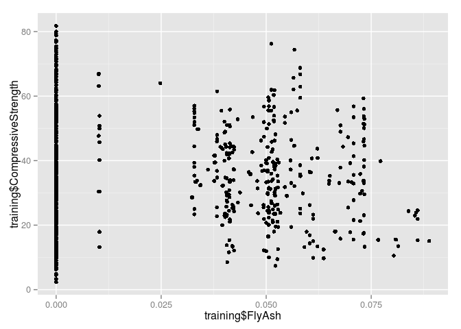
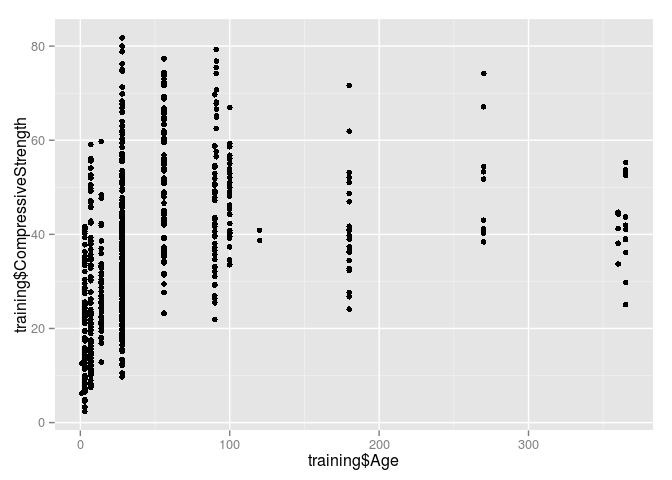

## Q1


```r
#install.packages("AppliedPredictiveModeling")
library(AppliedPredictiveModeling)
library(caret)
```

```
## Loading required package: lattice
## Loading required package: ggplot2
```

```r
data(AlzheimerDisease)

adData = data.frame(diagnosis,predictors)
trainIndex = createDataPartition(diagnosis, p = 0.50,list=FALSE)
training = adData[trainIndex,]
testing = adData[-trainIndex,]
```

## Q2

```r
data(concrete)
set.seed(975)
inTrain = createDataPartition(mixtures$CompressiveStrength, p = 3/4)[[1]]
training = mixtures[ inTrain,]
testing = mixtures[-inTrain,]
```

The feature plot:

```r
featurePlot(x=training[,c("FlyAsh", "Age")],
            y=training$CompressiveStrength,
            plot="pairs")
```

 

Simple plot:

```r
plot(training$CompressiveStrength)
```

 

Plot ater cutting FlyAsh:

```r
library(Hmisc)
```

```
## Loading required package: grid
## Loading required package: survival
## Loading required package: splines
## 
## Attaching package: 'survival'
## 
## The following object is masked from 'package:caret':
## 
##     cluster
## 
## Loading required package: Formula
## 
## Attaching package: 'Hmisc'
## 
## The following objects are masked from 'package:base':
## 
##     format.pval, round.POSIXt, trunc.POSIXt, units
```

```r
cutFlyAsh <- cut2(training$FlyAsh, g=3)
qplot(y=training$CompressiveStrength, colour=cutFlyAsh)
```

 

Plot after cutting Age:

```r
cutAge <- cut2(training$Age, g=4)
qplot(y=training$CompressiveStrength, colour=cutAge)
```

 

Plot outcome vs FlyAsh:

```r
qplot(training$FlyAsh, training$CompressiveStrength)
```

 

Plot outcome vs Age:

```r
qplot(training$Age, training$CompressiveStrength)
```

 

## Q3


```r
set.seed(975)
inTrain = createDataPartition(mixtures$CompressiveStrength, p = 3/4)[[1]]
training = mixtures[ inTrain,]
testing = mixtures[-inTrain,]
```

Plot histogram:

```r
hist(training$Superplasticizer)
```

 

```r
hist(log(training$Superplasticizer))
```

 


```r
str(training$Superplasticizer)
```

```
##  num [1:774] 0 0 0 0 0 ...
```

## Q4


```r
set.seed(3433)
data(AlzheimerDisease)
adData = data.frame(diagnosis,predictors)
inTrain = createDataPartition(adData$diagnosis, p = 3/4)[[1]]
training = adData[ inTrain,]
testing = adData[-inTrain,]
head(training)
```

```
##    diagnosis ACE_CD143_Angiotensin_Converti
## 6   Impaired                         0.4312
## 10  Impaired                         1.6023
## 11  Impaired                         1.8299
## 12  Impaired                         1.0012
## 13  Impaired                         1.3013
## 16  Impaired                         1.8656
##    ACTH_Adrenocorticotropic_Hormon     AXL Adiponectin
## 6                          -1.2730 -0.2224      -5.221
## 10                         -1.5141  0.4495      -5.573
## 11                         -0.9943  0.3664      -4.841
## 12                         -1.7148  0.3664      -4.200
## 13                         -1.7720 -0.0201      -6.166
## 16                         -1.6607  0.6077      -4.200
##    Alpha_1_Antichymotrypsin Alpha_1_Antitrypsin Alpha_1_Microglobulin
## 6                     1.308              -12.13                -2.551
## 10                    1.163              -12.13                -2.364
## 11                    1.099              -13.31                -3.079
## 12                    1.902              -11.84                -2.354
## 13                    1.253              -14.55                -3.324
## 16                    1.411              -11.98                -2.900
##    Alpha_2_Macroglobulin Angiopoietin_2_ANG_2 Angiotensinogen
## 6                -154.61             -0.05129           2.524
## 10               -144.94              0.53063           2.262
## 11                -91.37              0.83291           2.654
## 12               -132.72              0.26236           2.290
## 13               -204.13              0.26236           2.032
## 16                -94.72              1.30833           2.466
##    Apolipoprotein_A_IV Apolipoprotein_A1 Apolipoprotein_A2
## 6               -1.386            -7.402           -0.2744
## 10              -1.897            -7.143           -0.5621
## 11              -1.661            -7.250           -0.7550
## 12              -1.772            -7.470           -0.4005
## 13              -2.040            -8.079           -0.8440
## 16              -2.375            -7.684           -0.4780
##    Apolipoprotein_B Apolipoprotein_CI Apolipoprotein_CIII Apolipoprotein_D
## 6            -2.964            -1.661              -2.313            1.917
## 10           -6.411            -1.514              -1.966            1.482
## 11           -5.703            -1.514              -2.323            1.411
## 12           -4.167            -1.050              -1.833            1.281
## 13           -5.558            -2.207              -2.937            1.386
## 16           -4.235            -1.661              -2.577            1.361
##    Apolipoprotein_E Apolipoprotein_H B_Lymphocyte_Chemoattractant_BL
## 6            0.5911          0.09715                           2.480
## 10           3.7037         -0.12462                           2.182
## 11           2.7201         -0.28368                           1.853
## 12           3.1564         -0.78460                           2.687
## 13           1.3274         -0.32007                           1.853
## 16           2.5849         -0.53173                           2.976
##     BMP_6 Beta_2_Microglobulin Betacellulin C_Reactive_Protein   CD40
## 6  -1.877              -0.5447           51             -7.562 -1.784
## 10 -1.877               0.1823           59             -6.215 -1.242
## 11 -1.413               0.1823           32             -6.645 -1.341
## 12 -1.968              -0.1054           43             -4.828 -1.341
## 13 -1.675              -0.2744           51             -6.119 -1.452
## 16 -1.968               0.3365           58             -5.051 -1.376
##        CD5L Calbindin Calcitonin   CgA Clusterin_Apo_J Complement_3
## 6   0.40547     13.23     1.6292 137.9           2.565       -11.98
## 10  0.00000     20.63     4.1109 323.4           3.045       -13.00
## 11 -0.01005     29.37     2.6391 361.6           3.091       -11.84
## 12  0.83291     20.36     1.2809 251.9           2.833       -15.71
## 13 -1.23787     13.36     2.3026 288.6           2.565       -17.29
## 16 -0.26136     26.43     0.6931 372.6           3.045       -12.72
##    Complement_Factor_H Connective_Tissue_Growth_Factor Cortisol
## 6                3.574                          0.9933     13.0
## 10               4.684                          0.6931     17.0
## 11               4.024                          0.8755      6.8
## 12               4.684                          0.9163     12.0
## 13               3.780                          0.9555      9.2
## 16               4.255                          0.8329     12.0
##    Creatine_Kinase_MB Cystatin_C   EGF_R EN_RAGE ENA_78 Eotaxin_3      FAS
## 6              -1.671      7.836 -1.1112  -3.442 -1.364        57 -0.32850
## 10             -1.631      8.331 -0.7846  -3.772 -1.383        70 -0.07257
## 11             -1.751      8.376 -0.5175  -3.963 -1.383        82 -0.02020
## 12             -1.671      8.061 -0.6998  -1.309 -1.384        73 -0.71335
## 13             -1.610      7.912 -0.9763  -3.244 -1.364        70 -0.57982
## 16             -1.671      8.326 -0.5461  -3.576 -1.379        69 -0.41552
##    FSH_Follicle_Stimulation_Hormon Fas_Ligand Fatty_Acid_Binding_Protein
## 6                          -1.6833      2.407                     0.6237
## 10                         -0.6517      2.792                     1.1433
## 11                         -0.1796      3.981                     0.6237
## 12                         -1.4294      2.665                     0.5598
## 13                         -1.5587      2.073                     0.6237
## 16                         -1.9019      3.579                     2.6529
##    Ferritin Fetuin_A Fibrinogen GRO_alpha Gamma_Interferon_induced_Monokin
## 6     1.847    1.482     -6.438     1.398                            2.822
## 10    2.517    1.386     -7.059     1.351                            2.781
## 11    3.060    1.435     -7.524     1.413                            2.702
## 12    3.329    1.411     -7.279     1.398                            2.769
## 13    1.899    1.194     -7.452     1.372                            2.694
## 16    2.243    1.482     -7.222     1.413                            2.912
##    Glutathione_S_Transferase_alpha HB_EGF  HCC_4
## 6                           1.1538  6.413 -3.079
## 10                          1.0344  6.108 -3.244
## 11                          0.9677  8.542 -3.540
## 12                          1.0782  6.108 -2.919
## 13                          1.1302  6.108 -3.772
## 16                          0.7941  8.755 -3.576
##    Hepatocyte_Growth_Factor_HGF I_309  ICAM_1 IGF_BP_2 IL_11 IL_13 IL_16
## 6                       0.09531 2.708 -0.9351    5.056 6.103 1.283 2.671
## 10                      0.18232 2.996 -1.1112    5.384 4.593 1.269 3.476
## 11                      0.40547 3.091 -0.5607    5.505 6.920 1.274 2.155
## 12                      0.09531 3.258 -0.7330    5.081 3.219 1.286 3.594
## 13                     -0.08338 2.833 -0.5607    5.412 4.103 1.274 2.876
## 16                      0.18232 3.332 -1.0641    5.375 4.361 1.278 2.776
##    IL_17E IL_1alpha   IL_3  IL_4    IL_5    IL_6 IL_6_Receptor  IL_7  IL_8
## 6   3.637    -8.181 -3.863 1.209 -0.4005  0.1857      -0.51728 2.776 1.708
## 10  3.637    -7.370 -4.017 1.808  0.1823 -1.5343       0.09669 2.155 1.702
## 11  4.749    -7.849 -4.510 1.569  0.1823 -1.0965       0.35404 2.924 1.720
## 12  3.867    -8.047 -3.576 1.917  0.3365 -0.3987       0.09669 2.924 1.676
## 13  5.731    -7.849 -4.510 1.808  0.0000  0.4224      -0.53219 1.564 1.691
## 16  5.170    -7.663 -4.017 1.548  0.2624  0.4224       0.18740 1.270 1.705
##    IP_10_Inducible_Protein_10    IgA Insulin
## 6                       5.481 -5.809  -1.341
## 10                      5.333 -5.360  -1.034
## 11                      6.144 -5.776  -1.308
## 12                      5.165 -6.502  -1.083
## 13                      5.063 -7.036  -1.569
## 16                      5.598 -5.449  -1.410
##    Kidney_Injury_Molecule_1_KIM_1  LOX_1 Leptin Lipoprotein_a MCP_1 MCP_2
## 6                          -1.124 0.6419 -1.361        -4.510 6.541 2.334
## 10                         -1.164 1.1314 -1.537        -4.200 6.382 1.626
## 11                         -1.156 1.4816 -1.187        -5.573 6.607 4.024
## 12                         -1.154 1.4586 -1.999        -5.083 6.444 1.530
## 13                         -1.124 0.5878 -1.537        -3.540 6.615 1.626
## 16                         -1.202 1.8405 -1.329        -5.915 6.213 1.048
##       MIF MIP_1alpha MIP_1beta MMP_2  MMP_3  MMP10   MMP7 Myoglobin
## 6  -2.040      4.603     2.890 2.918 -3.037 -3.324 -1.922   -1.1394
## 10 -1.609      4.352     2.773 2.918 -1.966 -3.270 -3.000   -1.6607
## 11 -1.514      5.359     4.007 3.266 -2.303 -3.963 -3.774   -1.6607
## 12 -1.715      3.961     2.639 2.105 -2.303 -3.244 -3.000   -1.4271
## 13 -2.040      3.410     2.833 3.266 -2.040 -3.016 -4.356    0.1823
## 16 -1.514      4.479     2.565 2.332 -2.659 -3.124 -4.030   -2.5510
##    NT_proBNP NrCAM Osteopontin    PAI_1 PAPP_A  PLGF   PYY
## 6      4.190 3.258       4.736  0.43837 -2.936 4.394 3.332
## 10     4.522 4.234       5.283 -0.09566 -3.034 3.689 2.996
## 11     4.875 4.489       5.533  0.25230 -2.669 4.357 3.258
## 12     4.727 3.989       5.100  0.25230 -2.971 3.871 2.996
## 13     4.443 3.714       4.956  0.49055 -2.713 4.078 2.944
## 16     5.323 4.812       5.690  0.49055 -2.971 4.190 2.833
##    Pancreatic_polypeptide Prolactin Prostatic_Acid_Phosphatase Protein_S
## 6                 -0.4780  -0.15082                     -1.755    -2.358
## 10                 0.2624   0.74194                     -1.684    -2.358
## 11                -1.2730   0.40547                     -1.690    -2.081
## 12                 1.1632   0.26236                     -1.710    -2.259
## 13                -0.1054   0.33647                     -1.678    -2.358
## 16                 0.3365  -0.03046                     -1.631    -2.464
##    Pulmonary_and_Activation_Regulat RANTES Resistin S100b     SGOT   SHBG
## 6                            -1.171 -6.502   -11.29 1.055 -0.31471 -2.645
## 10                           -1.309 -6.725   -15.60 1.107 -0.54473 -2.120
## 11                           -1.204 -6.502   -11.29 1.757 -0.06188 -1.561
## 12                           -0.844 -6.571   -14.82 1.521 -0.31471 -2.313
## 13                           -1.966 -6.645   -18.01 1.055 -0.32850 -3.381
## 16                           -1.022 -6.032   -15.20 1.157 -0.10536 -1.109
##      SOD Serum_Amyloid_P Sortilin Stem_Cell_Factor TGF_alpha TIMP_1
## 6  4.543          -5.116    2.979            2.565    10.009  11.27
## 10 5.333          -6.266    4.037            3.466     9.162  11.11
## 11 5.489          -6.119    4.803            2.996    10.777  10.49
## 12 5.130          -5.449    4.093            3.091     9.549  10.96
## 13 4.836          -5.991    4.037            2.833    10.098  11.86
## 16 5.606          -6.032    4.480            3.135    10.777  12.70
##    TNF_RII TRAIL_R3 TTR_prealbumin Tamm_Horsfall_Protein_THP
## 6  -0.9416  -0.7380          3.045                    -3.126
## 10 -0.8210  -0.3179          2.890                    -3.117
## 11 -0.5108  -0.3712          2.833                    -3.111
## 12 -0.7133  -0.6826          2.833                    -3.126
## 13 -1.0498  -0.6826          2.890                    -3.123
## 16 -0.2877  -0.4856          2.890                    -3.129
##    Thrombomodulin Thrombopoietin Thymus_Expressed_Chemokine_TECK
## 6          -1.452        -1.0000                           4.534
## 10         -1.413        -0.6584                           4.534
## 11         -1.534        -0.8000                           4.909
## 12         -1.273        -0.5578                           3.637
## 13         -1.452        -0.8864                           2.792
## 16         -1.376        -0.8000                           4.093
##    Thyroid_Stimulating_Hormone Thyroxine_Binding_Globulin Tissue_Factor
## 6                       -4.423                     -1.238      -0.01005
## 10                      -4.510                     -1.514       0.95551
## 11                      -3.442                     -1.347       1.41099
## 12                      -4.605                     -1.273       1.02962
## 13                      -3.817                     -1.715       0.53063
## 16                      -4.893                     -1.171       1.66771
##    Transferrin Trefoil_Factor_3_TFF3 VCAM_1  VEGF Vitronectin
## 6        2.996                -4.343  2.208 13.20      0.2624
## 10       2.890                -3.912  2.639 15.62     -0.4005
## 11       2.773                -4.017  2.708 15.65     -0.1165
## 12       2.996                -4.135  2.398 17.16     -0.1508
## 13       2.639                -4.423  2.092 14.20     -0.4620
## 16       3.091                -2.957  3.219 17.48     -0.1985
##    von_Willebrand_Factor    age   tau p_tau  Ab_42 male Genotype
## 6                 -4.510 0.9842 5.361 3.466 11.227    1     E4E4
## 10                -3.912 0.9882 6.094 4.256 10.530    0     E2E3
## 11                -3.612 0.9862 6.161 4.425  9.764    0     E3E4
## 12                -4.200 0.9870 5.889 4.191 13.097    1     E2E3
## 13                -4.269 0.9838 5.064 3.293 11.275    1     E3E3
## 16                -3.863 0.9866 6.879 4.913 12.458    0     E3E4
```

Preprocess with ACP (here we specify thresh parameter):

```r
# Filter columns
ILcolnames <- grep("^IL", colnames(training))
preProc <- preProcess(training[,ILcolnames], method="pca", thresh=0.90)
preProc$numComp
```

```
## [1] 9
```

## Q5


```r
set.seed(3433)
data(AlzheimerDisease)
adData = data.frame(diagnosis,predictors)
inTrain = createDataPartition(adData$diagnosis, p = 3/4)[[1]]
training = adData[ inTrain,]
testing = adData[-inTrain,]
# Filter columns
ILcolnames <- grep("^IL", colnames(training))
```

First model without PCA:

```r
modelWithoutPCA <- train(diagnosis ~ ., data=training[,c(1,ILcolnames)], method="glm")
summary(modelWithoutPCA)
```

```
## 
## Call:
## NULL
## 
## Deviance Residuals: 
##    Min      1Q  Median      3Q     Max  
## -2.362  -0.958   0.583   0.814   1.454  
## 
## Coefficients:
##               Estimate Std. Error z value Pr(>|z|)   
## (Intercept)     4.6184    25.0031    0.18   0.8535   
## IL_11          -0.0605     0.1127   -0.54   0.5915   
## IL_13          10.0664    17.3350    0.58   0.5614   
## IL_16          -0.6371     0.4134   -1.54   0.1232   
## IL_17E          0.3236     0.1320    2.45   0.0142 * 
## IL_1alpha      -0.4903     0.4348   -1.13   0.2594   
## IL_3            0.7693     0.5522    1.39   0.1636   
## IL_4           -0.2031     0.3768   -0.54   0.5899   
## IL_5            0.1206     0.5242    0.23   0.8181   
## IL_6            0.1116     0.2798    0.40   0.6899   
## IL_6_Receptor  -0.3369     0.5322   -0.63   0.5267   
## IL_7            0.5587     0.2094    2.67   0.0076 **
## IL_8          -10.4399     5.5090   -1.90   0.0581 . 
## ---
## Signif. codes:  0 '***' 0.001 '**' 0.01 '*' 0.05 '.' 0.1 ' ' 1
## 
## (Dispersion parameter for binomial family taken to be 1)
## 
##     Null deviance: 295.21  on 250  degrees of freedom
## Residual deviance: 267.52  on 238  degrees of freedom
## AIC: 293.5
## 
## Number of Fisher Scoring iterations: 4
```

```r
predictionWithoutPCA <- predict(modelWithoutPCA, testing[,c(1,ILcolnames)])
predictionWithoutPCA
```

```
##  [1] Control  Impaired Control  Control  Control  Control  Control 
##  [8] Control  Control  Control  Control  Control  Control  Control 
## [15] Impaired Control  Control  Control  Impaired Control  Control 
## [22] Control  Impaired Control  Control  Control  Control  Control 
## [29] Control  Control  Control  Impaired Control  Control  Control 
## [36] Control  Control  Control  Control  Control  Control  Control 
## [43] Impaired Control  Control  Control  Control  Control  Control 
## [50] Control  Impaired Control  Impaired Control  Control  Control 
## [57] Control  Control  Impaired Control  Control  Impaired Control 
## [64] Control  Control  Control  Control  Control  Control  Control 
## [71] Control  Control  Control  Control  Control  Control  Control 
## [78] Impaired Control  Control  Control  Control 
## Levels: Impaired Control
```

```r
confusionMatrix(testing$diagnosis, predictionWithoutPCA)
```

```
## Confusion Matrix and Statistics
## 
##           Reference
## Prediction Impaired Control
##   Impaired        2      20
##   Control         9      51
##                                         
##                Accuracy : 0.646         
##                  95% CI : (0.533, 0.749)
##     No Information Rate : 0.866         
##     P-Value [Acc > NIR] : 1.0000        
##                                         
##                   Kappa : -0.07         
##  Mcnemar's Test P-Value : 0.0633        
##                                         
##             Sensitivity : 0.1818        
##             Specificity : 0.7183        
##          Pos Pred Value : 0.0909        
##          Neg Pred Value : 0.8500        
##              Prevalence : 0.1341        
##          Detection Rate : 0.0244        
##    Detection Prevalence : 0.2683        
##       Balanced Accuracy : 0.4501        
##                                         
##        'Positive' Class : Impaired      
## 
```

Second model with PCA:

```r
preProc <- preProcess(training[,ILcolnames], thresh=0.80, method="pca")
trainingPC <- predict(preProc, training[,ILcolnames])
modelWithPCA <- train(training$diagnosis ~ ., data=trainingPC, method="glm")
summary(modelWithPCA)
```

```
## 
## Call:
## NULL
## 
## Deviance Residuals: 
##    Min      1Q  Median      3Q     Max  
## -2.344  -1.165   0.657   0.823   1.446  
## 
## Coefficients:
##             Estimate Std. Error z value Pr(>|z|)    
## (Intercept)   1.0597     0.1525    6.95  3.7e-12 ***
## PC1           0.0150     0.0718    0.21    0.834    
## PC2          -0.2892     0.1313   -2.20    0.028 *  
## PC3           0.1455     0.1390    1.05    0.295    
## PC4          -0.2453     0.1458   -1.68    0.092 .  
## PC5           0.2608     0.1618    1.61    0.107    
## PC6           0.3695     0.1800    2.05    0.040 *  
## PC7           0.3703     0.1903    1.95    0.052 .  
## ---
## Signif. codes:  0 '***' 0.001 '**' 0.01 '*' 0.05 '.' 0.1 ' ' 1
## 
## (Dispersion parameter for binomial family taken to be 1)
## 
##     Null deviance: 295.21  on 250  degrees of freedom
## Residual deviance: 275.63  on 243  degrees of freedom
## AIC: 291.6
## 
## Number of Fisher Scoring iterations: 4
```

```r
testingPC <- predict(preProc, testing[,ILcolnames])
predictionWithPCA <- predict(modelWithPCA, testingPC)
predictionWithPCA
```

```
##  [1] Control  Control  Control  Control  Control  Control  Control 
##  [8] Control  Control  Control  Control  Control  Control  Control 
## [15] Impaired Control  Control  Control  Impaired Control  Control 
## [22] Control  Control  Control  Control  Control  Control  Control 
## [29] Control  Control  Control  Control  Control  Control  Control 
## [36] Control  Control  Control  Impaired Control  Control  Control 
## [43] Control  Control  Control  Control  Control  Control  Control 
## [50] Control  Control  Control  Impaired Control  Control  Control 
## [57] Control  Control  Impaired Impaired Control  Control  Control 
## [64] Control  Control  Control  Control  Control  Control  Control 
## [71] Control  Control  Control  Impaired Control  Control  Control 
## [78] Control  Control  Control  Control  Control 
## Levels: Impaired Control
```

```r
confusionMatrix(testing$diagnosis, predictionWithPCA)
```

```
## Confusion Matrix and Statistics
## 
##           Reference
## Prediction Impaired Control
##   Impaired        3      19
##   Control         4      56
##                                         
##                Accuracy : 0.72          
##                  95% CI : (0.609, 0.813)
##     No Information Rate : 0.915         
##     P-Value [Acc > NIR] : 1.00000       
##                                         
##                   Kappa : 0.089         
##  Mcnemar's Test P-Value : 0.00351       
##                                         
##             Sensitivity : 0.4286        
##             Specificity : 0.7467        
##          Pos Pred Value : 0.1364        
##          Neg Pred Value : 0.9333        
##              Prevalence : 0.0854        
##          Detection Rate : 0.0366        
##    Detection Prevalence : 0.2683        
##       Balanced Accuracy : 0.5876        
##                                         
##        'Positive' Class : Impaired      
## 
```
