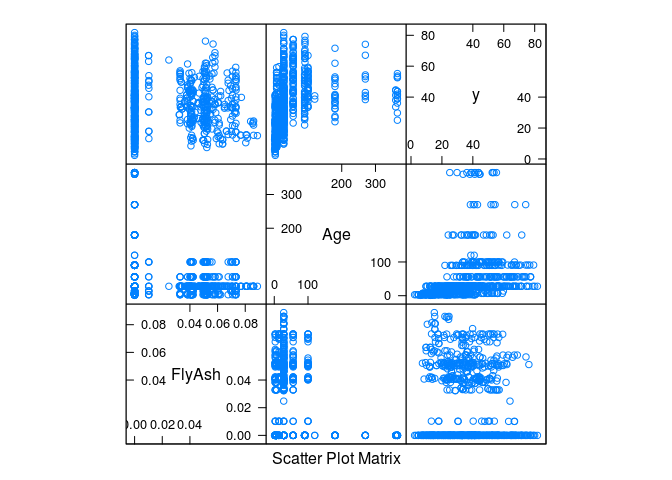
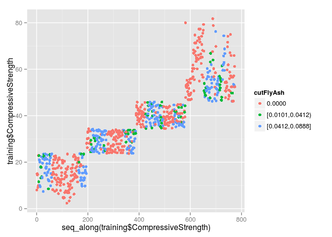
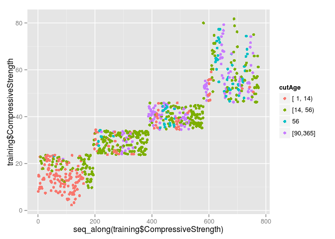

## Q1


```r
#install.packages("AppliedPredictiveModeling")
library(AppliedPredictiveModeling)
library(caret)
```

```
## Loading required package: lattice
## Loading required package: ggplot2
```

```r
data(AlzheimerDisease)

adData = data.frame(diagnosis,predictors)
trainIndex = createDataPartition(diagnosis, p = 0.50,list=FALSE)
training = adData[trainIndex,]
testing = adData[-trainIndex,]
```

## Q2

```r
data(concrete)
set.seed(975)
inTrain = createDataPartition(mixtures$CompressiveStrength, p = 3/4)[[1]]
training = mixtures[ inTrain,]
testing = mixtures[-inTrain,]
```

The feature plot:

```r
featurePlot(x=training,
            y=seq_along(training$CompressiveStrength),
            plot="pairs")
```

 

Simple plot:

```r
plot(training$CompressiveStrength)
```

 

Plot ater cutting FlyAsh:

```r
library(Hmisc)
```

```
## Loading required package: grid
## Loading required package: survival
## Loading required package: splines
## 
## Attaching package: 'survival'
## 
## The following object is masked from 'package:caret':
## 
##     cluster
## 
## Loading required package: Formula
## 
## Attaching package: 'Hmisc'
## 
## The following objects are masked from 'package:base':
## 
##     format.pval, round.POSIXt, trunc.POSIXt, units
```

```r
cutFlyAsh <- cut2(training$FlyAsh, g=3)
qplot(y=training$CompressiveStrength, colour=cutFlyAsh)
```

 

Plot after cutting Age:

```r
cutAge <- cut2(training$Age, g=3)
qplot(y=training$CompressiveStrength, colour=cutAge)
```

 
