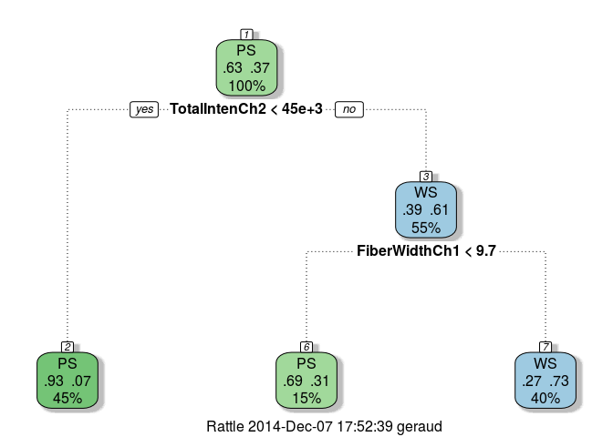
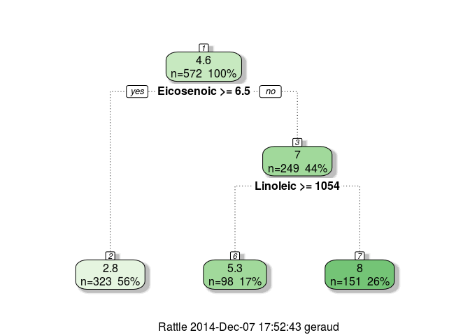

## Q1


```r
library(AppliedPredictiveModeling)
data(segmentationOriginal)
library(caret)
```

```
## Loading required package: lattice
## Loading required package: ggplot2
```


```r
training <- segmentationOriginal[segmentationOriginal$Case == "Train", ]
testing <- segmentationOriginal[segmentationOriginal$Case == "Test", ]
```


```r
library(rattle)
```

```
## Rattle: A free graphical interface for data mining with R.
## Version 3.3.0 Copyright (c) 2006-2014 Togaware Pty Ltd.
## Type 'rattle()' to shake, rattle, and roll your data.
```

```r
set.seed(125)

modelFit <- train( Class ~ ., data = training, method = "rpart")
```

```
## Loading required package: rpart
```

```r
predictions <- predict(modelFit, newdata = testing)
confusionMatrix(predictions, testing$Class)
```

```
## Confusion Matrix and Statistics
## 
##           Reference
## Prediction  PS  WS
##         PS 521  82
##         WS 143 264
##                                        
##                Accuracy : 0.777        
##                  95% CI : (0.75, 0.803)
##     No Information Rate : 0.657        
##     P-Value [Acc > NIR] : < 2e-16      
##                                        
##                   Kappa : 0.525        
##  Mcnemar's Test P-Value : 6.33e-05     
##                                        
##             Sensitivity : 0.785        
##             Specificity : 0.763        
##          Pos Pred Value : 0.864        
##          Neg Pred Value : 0.649        
##              Prevalence : 0.657        
##          Detection Rate : 0.516        
##    Detection Prevalence : 0.597        
##       Balanced Accuracy : 0.774        
##                                        
##        'Positive' Class : PS           
## 
```

```r
fancyRpartPlot(modelFit$finalModel)
```

 

## Q3


```r
# install.packages('pgmm')
library(pgmm)
data(olive)
olive = olive[,-1]
```


```r
modelOliveFit <- train( Area ~ ., data = olive, method = "rpart")
```

```
## Warning: There were missing values in resampled performance measures.
```

```r
fancyRpartPlot(modelOliveFit$finalModel)
```

 


```r
newdata = as.data.frame(t(colMeans(olive)))
olivePredictions <- predict(modelOliveFit, newdata = newdata)
olivePredictions
```

```
## [1] 2.783
```

## Q4


```r
# install.packages('ElemStatLearn')
library(ElemStatLearn)
data(SAheart)
set.seed(8484)
train = sample(1:dim(SAheart)[1],size=dim(SAheart)[1]/2,replace=F)
trainSA = SAheart[train,]
testSA = SAheart[-train,]
```


```r
set.seed(13234)
modelHeartFit <- train(chd ~ age + alcohol + obesity + tobacco + typea + ldl,
                       data = trainSA,
                       method = "glm",
                       family = "binomial")
modelHeartFit$finalModel
```

```
## 
## Call:  NULL
## 
## Coefficients:
## (Intercept)          age      alcohol      obesity      tobacco  
##    -2.71236      0.06561     -0.00324     -0.13241      0.10374  
##       typea          ldl  
##     0.02894      0.16544  
## 
## Degrees of Freedom: 230 Total (i.e. Null);  224 Residual
## Null Deviance:	    303 
## Residual Deviance: 238 	AIC: 252
```


```r
heartTrainPredictions <- predict(modelHeartFit)
heartPredictions <- predict(modelHeartFit, newdata = testSA)

missClass = function(values,prediction){sum(((prediction > 0.5)*1) != values)/length(values)}
trainingSetMisclassification <- missClass(trainSA$chd, heartTrainPredictions)
testingSetMisclassification <- missClass(testSA$chd, heartPredictions)

trainingSetMisclassification
```

```
## [1] 0.2727
```

```r
testingSetMisclassification
```

```
## [1] 0.3117
```

## Q5


```r
library(ElemStatLearn)
data(vowel.train)
data(vowel.test)
```


```r
vowel.train$y <- as.factor(vowel.train$y)
vowel.test$y <- as.factor(vowel.test$y)
```


```r
set.seed(33833)
vowelModel1 <- train(y ~ . , data = vowel.train, model = "rf", type = 1, importance = FALSE)
```

```
## Loading required package: randomForest
## randomForest 4.6-10
## Type rfNews() to see new features/changes/bug fixes.
```

```r
vowelModel2 <- train(y ~ . , data = vowel.train, model = "rf", type = 2, importance = FALSE)
varImp(vowelModel1)
```

```
## rf variable importance
## 
##      Overall
## x.2   100.00
## x.1    92.57
## x.5    44.52
## x.6    27.94
## x.8    16.97
## x.4    10.10
## x.3     7.55
## x.9     7.49
## x.7     2.77
## x.10    0.00
```

```r
varImp(vowelModel2)
```

```
## rf variable importance
## 
##      Overall
## x.1   100.00
## x.2    97.59
## x.5    37.81
## x.6    31.08
## x.8    24.90
## x.4     9.63
## x.3     9.20
## x.9     7.39
## x.7     2.77
## x.10    0.00
```

