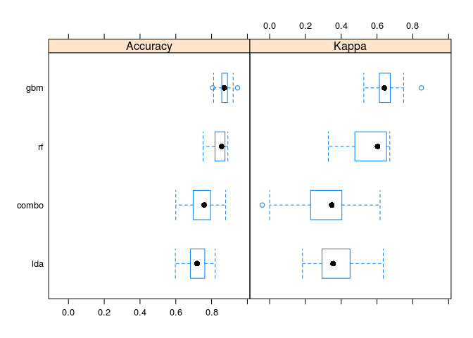
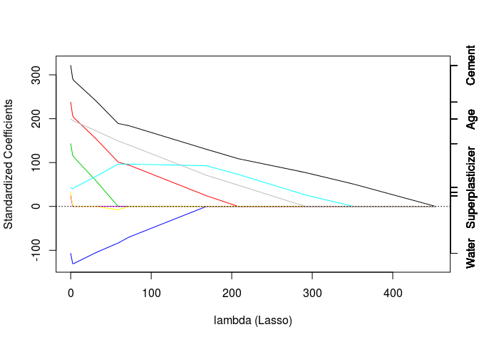
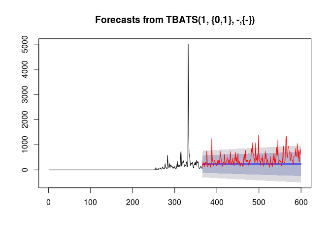

```r
library(caret)
```

```
## Loading required package: lattice
## Loading required package: ggplot2
```

## Q1


```r
library(ElemStatLearn)
data(vowel.train)
data(vowel.test) 

vowel.train$y <- as.factor(vowel.train$y)
vowel.test$y <- as.factor(vowel.test$y)
```


```r
set.seed(33833)
rf.fit <- train(y ~ ., data = vowel.train, method = 'rf')
```

```
## Loading required package: randomForest
## randomForest 4.6-10
## Type rfNews() to see new features/changes/bug fixes.
```


```r
gbm.fit <- train(y ~ ., data = vowel.train, method = 'gbm', verbose = FALSE)
```

```
## Loading required package: gbm
## Loading required package: survival
## Loading required package: splines
## 
## Attaching package: 'survival'
## 
## The following object is masked from 'package:caret':
## 
##     cluster
## 
## Loading required package: parallel
## Loaded gbm 2.1
## Loading required package: plyr
## 
## Attaching package: 'plyr'
## 
## The following object is masked from 'package:ElemStatLearn':
## 
##     ozone
```


```r
rf.predict <- predict(rf.fit, newdata = vowel.test)
```

```
## Loading required package: randomForest
## randomForest 4.6-10
## Type rfNews() to see new features/changes/bug fixes.
```

```r
gbm.predict <- predict(gbm.fit, newdata = vowel.test)
```

```
## Loading required package: gbm
## Loading required package: survival
## Loading required package: splines
## 
## Attaching package: 'survival'
## 
## The following object is masked from 'package:caret':
## 
##     cluster
## 
## Loading required package: parallel
## Loaded gbm 2.1
## Loading required package: plyr
## 
## Attaching package: 'plyr'
## 
## The following object is masked from 'package:ElemStatLearn':
## 
##     ozone
```


```r
rf.confusion <- confusionMatrix(rf.predict, vowel.test$y)
gbm.confusion <- confusionMatrix(gbm.predict, vowel.test$y)
```

Accuracy for RF is 0.6061.
Accuracy for GBM is 0.5303.

Agreed accuracy is:

```r
mean(rf.predict == gbm.predict)
```

```
## [1] 0.697
```

## Q2


```r
library(caret)
library(gbm)
set.seed(3433)
library(AppliedPredictiveModeling)
data(AlzheimerDisease)
adData = data.frame(diagnosis,predictors)
inTrain = createDataPartition(adData$diagnosis, p = 3/4)[[1]]
training = adData[ inTrain,]
testing = adData[-inTrain,]
```


```r
model <- list()
set.seed(62433)
model$rf <- train(diagnosis ~ ., data = training, method = 'rf')
model$gbm <- train(diagnosis ~ ., data = training, method = 'gbm', verbose = FALSE)
model$lda <- train(diagnosis ~ ., data = training, method = 'lda')
```

```
## Warning: variables are collinear
## Warning: variables are collinear
## Warning: variables are collinear
```

Compose the models:

```r
predictions <- list()
predictions$rf <- predict(model$rf, newdata = testing)
predictions$gbm <- predict(model$gbm, newdata = testing)
predictions$lda <- predict(model$lda, newdata = testing)
modelsDf <- data.frame(predictions$rf, predictions$gbm, predictions$lda, diagnosis = testing$diagnosis)

model$combo <- train(diagnosis ~ ., data = modelsDf, method = 'rf')
```

```
## note: only 2 unique complexity parameters in default grid. Truncating the grid to 2 .
```

Compare the models:

```r
results <- resamples(model)
summary(results)
```

```
## 
## Call:
## summary.resamples(object = results)
## 
## Models: rf, gbm, lda, combo 
## Number of resamples: 25 
## 
## Accuracy 
##        Min. 1st Qu. Median  Mean 3rd Qu.  Max. NA's
## rf    0.753   0.819  0.856 0.845   0.875 0.891    0
## gbm   0.806   0.857  0.871 0.871   0.889 0.945    0
## lda   0.598   0.681  0.719 0.718   0.762 0.820    0
## combo 0.600   0.697  0.759 0.751   0.794 0.879    0
## 
## Kappa 
##          Min. 1st Qu. Median  Mean 3rd Qu.  Max. NA's
## rf     0.3280   0.476  0.603 0.561   0.653 0.671    0
## gbm    0.5260   0.613  0.641 0.652   0.674 0.848    0
## lda    0.1830   0.293  0.354 0.375   0.449 0.635    0
## combo -0.0417   0.229  0.347 0.316   0.404 0.617    0
```

```r
bwplot(results)
```

 


```r
confusionMatrix(predictions$rf, testing$diagnosis)$overall[1]
```

```
## Accuracy 
##   0.7683
```

```r
confusionMatrix(predictions$gbm, testing$diagnosis)$overall[1]
```

```
## Accuracy 
##   0.7927
```

```r
confusionMatrix(predictions$lda, testing$diagnosis)$overall[1]
```

```
## Accuracy 
##   0.7683
```

```r
predictions$combo <- predict(model$combo, modelsDf)
confusionMatrix(predictions$combo, testing$diagnosis)$overall[1]
```

```
## Accuracy 
##   0.8049
```

## Q3


```r
set.seed(3523)
library(AppliedPredictiveModeling)
data(concrete)
inTrain = createDataPartition(concrete$CompressiveStrength, p = 3/4)[[1]]
training = concrete[ inTrain,]
testing = concrete[-inTrain,]
```


```r
lasso.fit <- train(CompressiveStrength ~ ., data = training, method = 'lasso')
```

```
## Loading required package: elasticnet
## Loading required package: lars
## Loaded lars 1.2
```

```r
plot(lasso.fit$finalModel, xvar= 'penalty', use.color = TRUE)
```

 

## Q4


```r
#install.packages('lubridate')
library(lubridate)  # For year() function below
```

```
## 
## Attaching package: 'lubridate'
## 
## The following object is masked from 'package:plyr':
## 
##     here
```

```r
file = url("http://d396qusza40orc.cloudfront.net/predmachlearn/gaData.csv")
dat = read.csv(file)
training = dat[year(dat$date) < 2012,]
testing = dat[(year(dat$date)) > 2011,]
tstrain = ts(training$visitsTumblr)
tstesting = ts(testing$visitsTumblr, start = end(tstrain))
```


```r
#install.packages('forecast')
library(forecast)
```

```
## Loading required package: zoo
## 
## Attaching package: 'zoo'
## 
## The following objects are masked from 'package:base':
## 
##     as.Date, as.Date.numeric
## 
## Loading required package: timeDate
## This is forecast 5.7
```

```r
plot(tstrain)
```

 


```r
bats.fit <- bats(tstrain)
bats.fcast <- forecast(bats.fit, h = length(tstesting))
plot(bats.fcast); lines(tstesting, col='red')
```

 

```r
accuracy(bats.fcast, tstesting)
```

```
##                 ME  RMSE    MAE   MPE  MAPE   MASE   ACF1 Theil's U
## Training set  10.4 258.8  40.23  -Inf   Inf 0.8437 0.0121        NA
## Test set     186.7 301.8 206.37 27.07 40.14 4.3283 0.4720     1.101
```

```r
mean(tstesting < bats.fcast$upper[,2] & tstesting > bats.fcast$lower[,1])
```

```
## [1] 0.9617
```

## Q5


```r
set.seed(3523)
library(AppliedPredictiveModeling)
data(concrete)
inTrain = createDataPartition(concrete$CompressiveStrength, p = 3/4)[[1]]
training = concrete[ inTrain,]
testing = concrete[-inTrain,]
```


```r
library(e1071)
```

```
## 
## Attaching package: 'e1071'
## 
## The following objects are masked from 'package:timeDate':
## 
##     kurtosis, skewness
```

```r
svm.fit <- svm(CompressiveStrength ~ ., data = training)
summary(svm.fit)
```

```
## 
## Call:
## svm(formula = CompressiveStrength ~ ., data = training)
## 
## 
## Parameters:
##    SVM-Type:  eps-regression 
##  SVM-Kernel:  radial 
##        cost:  1 
##       gamma:  0.125 
##     epsilon:  0.1 
## 
## 
## Number of Support Vectors:  569
```

```r
svm.pred <- predict(svm.fit, testing)
```

RMSE is 6.715

