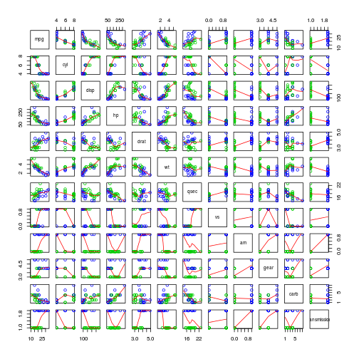

# Analysis of relationship between car transmission and fuel consumption

## Synopsis

We will use the mtcars dataset to determine the kind of transmission (automatic/manual)
that has the most Miles per Gallon, and in which proportion.

## Data processing

We will use the mtcars dataset included in the R core.

Format is: 
    
* TODO

First we load the data:


```r
data(mtcars)
names(mtcars)
```

```
##  [1] "mpg"  "cyl"  "disp" "hp"   "drat" "wt"   "qsec" "vs"   "am"   "gear"
## [11] "carb"
```

```r
nrow(mtcars)
```

```
## [1] 32
```

```r
head(mtcars)
```

```
##                    mpg cyl disp  hp drat    wt  qsec vs am gear carb
## Mazda RX4         21.0   6  160 110 3.90 2.620 16.46  0  1    4    4
## Mazda RX4 Wag     21.0   6  160 110 3.90 2.875 17.02  0  1    4    4
## Datsun 710        22.8   4  108  93 3.85 2.320 18.61  1  1    4    1
## Hornet 4 Drive    21.4   6  258 110 3.08 3.215 19.44  1  0    3    1
## Hornet Sportabout 18.7   8  360 175 3.15 3.440 17.02  0  0    3    2
## Valiant           18.1   6  225 105 2.76 3.460 20.22  1  0    3    1
```

Next we prepare the data (to have proper label when drawing plots):

```r
mtcars <- transform(mtcars, transmission = factor(mtcars$am,
                                                     levels = c(0,1),
                                                     labels = c("Automatic", "Manual")))
```

## Exploratory analysis

We would like to determine if there is a relationship between transmission an mpg.


```r
boxplot(mpg~transmission,data=mtcars, main="Car Milage Data",
   xlab="Transmission type", ylab="Miles Per Gallon") 
```

 

So it seems there is a relation between transmission and mpg: cars use more fuel when
transmission is manual than automatic.

## Best transmission type

We will perform a Student's t-test to analyze the difference of mean mpg between automatic and manual transmissions. Let's suppose that:

* H_0 (null hypothesis) is "there are no difference in means between the two groups"
* H_a (alternative hypothesis) is "the means are different between the two groups"


```r
t.test(mtcars$mpg[mtcars$am == 0], mtcars$mpg[mtcars$am == 1])
```

```
## 
## 	Welch Two Sample t-test
## 
## data:  mtcars$mpg[mtcars$am == 0] and mtcars$mpg[mtcars$am == 1]
## t = -3.767, df = 18.33, p-value = 0.001374
## alternative hypothesis: true difference in means is not equal to 0
## 95 percent confidence interval:
##  -11.28  -3.21
## sample estimates:
## mean of x mean of y 
##     17.15     24.39
```

The test gives a p-value less than 0.05, so we reject the null hypothesis and assume there is a difference between the two groups.

The confidence interval being negative, it tends to prove that manual transmission have greater mpg.

## Regression model

Now, we will try to quantify the difference between the two type of transmission on weight:


```r
model.1 <- lm(mpg~transmission, data=mtcars)
model.1.summary <- summary(model.1)
model.1.summary
```

```
## 
## Call:
## lm(formula = mpg ~ transmission, data = mtcars)
## 
## Residuals:
##    Min     1Q Median     3Q    Max 
## -9.392 -3.092 -0.297  3.244  9.508 
## 
## Coefficients:
##                    Estimate Std. Error t value Pr(>|t|)    
## (Intercept)           17.15       1.12   15.25  1.1e-15 ***
## transmissionManual     7.24       1.76    4.11  0.00029 ***
## ---
## Signif. codes:  0 '***' 0.001 '**' 0.01 '*' 0.05 '.' 0.1 ' ' 1
## 
## Residual standard error: 4.9 on 30 degrees of freedom
## Multiple R-squared:  0.36,	Adjusted R-squared:  0.338 
## F-statistic: 16.9 on 1 and 30 DF,  p-value: 0.000285
```

This model shows that:

* the coefficient is statistically significant (with a p-value of 2.8502 &times; 10<sup>-4</sup>)
* transmission explains 35.9799% of the variance
* when the transmision change from automatic (0) to manual(1), there is an increase in mpg of
7.2449

Next the confidence interval:


```r
confint(model.1)
```

```
##                     2.5 % 97.5 %
## (Intercept)        14.851  19.44
## transmissionManual  3.642  10.85
```

Then we plot the residuals:


```r
plot(resid(model.1), col = 5+ mtcars$am)
abline(0,0, col="blue", lw="3")
```

 

The points are randomly placed around the blue line, so there is no relation between the residual and the outcome.

Next we will try to improve our model by adding other variables, first let's look at the correlation matrix:


```r
pairs(mtcars, panel = panel.smooth, col=3+mtcars$am)
```

 

Model with cylinder:

```r
model.2 <- lm(mpg ~ transmission + factor(cyl), mtcars)
summary(model.2)
```

```
## 
## Call:
## lm(formula = mpg ~ transmission + factor(cyl), data = mtcars)
## 
## Residuals:
##    Min     1Q Median     3Q    Max 
## -5.962 -1.497 -0.206  1.891  6.538 
## 
## Coefficients:
##                    Estimate Std. Error t value Pr(>|t|)    
## (Intercept)           24.80       1.32   18.75  < 2e-16 ***
## transmissionManual     2.56       1.30    1.97  0.05846 .  
## factor(cyl)6          -6.16       1.54   -4.01  0.00041 ***
## factor(cyl)8         -10.07       1.45   -6.93  1.5e-07 ***
## ---
## Signif. codes:  0 '***' 0.001 '**' 0.01 '*' 0.05 '.' 0.1 ' ' 1
## 
## Residual standard error: 3.07 on 28 degrees of freedom
## Multiple R-squared:  0.765,	Adjusted R-squared:  0.74 
## F-statistic: 30.4 on 3 and 28 DF,  p-value: 5.96e-09
```

Model with weight:

```r
model.3 <- lm(mpg ~ transmission + wt, mtcars)
summary(model.3)
```

```
## 
## Call:
## lm(formula = mpg ~ transmission + wt, data = mtcars)
## 
## Residuals:
##    Min     1Q Median     3Q    Max 
## -4.530 -2.362 -0.132  1.403  6.878 
## 
## Coefficients:
##                    Estimate Std. Error t value Pr(>|t|)    
## (Intercept)         37.3216     3.0546   12.22  5.8e-13 ***
## transmissionManual  -0.0236     1.5456   -0.02     0.99    
## wt                  -5.3528     0.7882   -6.79  1.9e-07 ***
## ---
## Signif. codes:  0 '***' 0.001 '**' 0.01 '*' 0.05 '.' 0.1 ' ' 1
## 
## Residual standard error: 3.1 on 29 degrees of freedom
## Multiple R-squared:  0.753,	Adjusted R-squared:  0.736 
## F-statistic: 44.2 on 2 and 29 DF,  p-value: 1.58e-09
```

Let's compare those 2 new models with the first one:

```r
anova(model.1, model.2)
```

```
## Analysis of Variance Table
## 
## Model 1: mpg ~ transmission
## Model 2: mpg ~ transmission + factor(cyl)
##   Res.Df RSS Df Sum of Sq    F Pr(>F)    
## 1     30 721                             
## 2     28 264  2       456 24.2  8e-07 ***
## ---
## Signif. codes:  0 '***' 0.001 '**' 0.01 '*' 0.05 '.' 0.1 ' ' 1
```

```r
anova(model.1, model.3)
```

```
## Analysis of Variance Table
## 
## Model 1: mpg ~ transmission
## Model 2: mpg ~ transmission + wt
##   Res.Df RSS Df Sum of Sq    F  Pr(>F)    
## 1     30 721                              
## 2     29 278  1       443 46.1 1.9e-07 ***
## ---
## Signif. codes:  0 '***' 0.001 '**' 0.01 '*' 0.05 '.' 0.1 ' ' 1
```

To be included: multiple variable models, residuals...

* plot(fit, which=1)
* dfbeta: see influence of outlier (near 0 = less influence)
* hatvalue: ratio of influence (near 0 = less influence, near 1 = more influence)
* rstandard: computes the standardized residual (plot(fit, which=3)) / see also rstudent
* qqplot: plot(fit, which=2)
* cook's distance: plot(fit, which=5)
